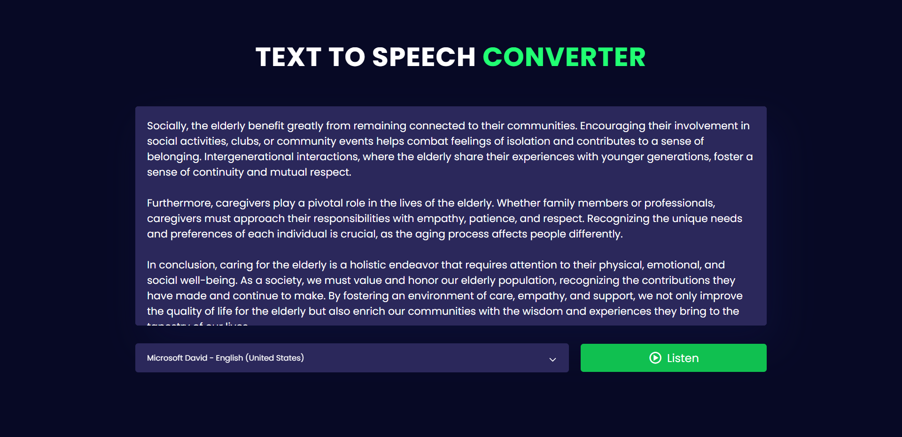

# Text-to-Speech Converter

Welcome to the Text-to-Speech Converter repository! This project is a JavaScript-based web application designed to convert text into speech. Built with HTML, CSS, and JavaScript, it features a modern UI design for an intuitive and user-friendly experience.

## Preview



## Features

- **Text-to-Speech Conversion:** Transform entered text into spoken words.
- **Modern UI Design:** Sleek layout and visually appealing design for an enjoyable user interface.
- **Easy to Use:** Simple interface for efficient text-to-speech conversion.

## Getting Started

To run the Text-to-Speech Converter locally, follow these steps:

1. Clone the repository to your local machine:

   ```bash
   git clone https://github.com/Devsethi3/Text-To-Speech-Converter.git
   ```

2. Open the `index.html` file in your preferred web browser.

## Usage

1. Enter the text you want to convert to speech in the input area.
2. Click the "Convert to Speech" button.
3. Listen to the converted speech.

## Customization

Feel free to customize this project to fit your preferences. Update styles, colors, and layout in the HTML and CSS files. You can also extend the functionality to include additional features or customization options.

## Contributing

If you'd like to contribute to this project, please follow these steps:

1. Fork the repository.
2. Create a new branch for your feature or improvement.
3. Make your changes and commit them with descriptive messages.
4. Push your changes to your forked repository.
5. Open a pull request to merge your changes into the main branch.

## License

Explore the Text-to-Speech Converter, convert text into speech effortlessly, and consider contributing to its development. Thank you for checking out the repository!